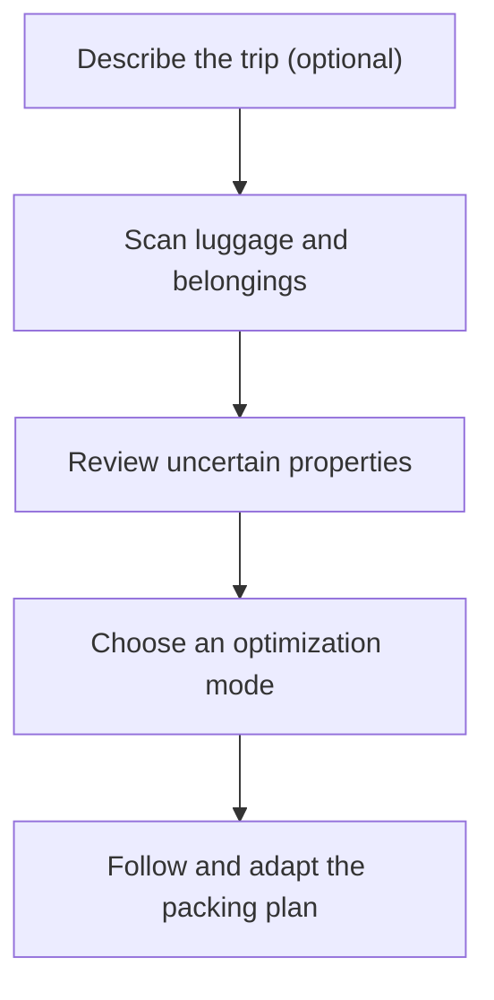

# Packing Scanning

A 3D scan-first packing assistant that helps travellers decide what to bring and shows how to fit it into a suitcase, backpack, travel bag, box, or other container.

## Product status

The local-first web planner and a native guided-capture prototype are now in this repository. This is an early product build, not a released or physically validated scanner.

### Run it locally

Requires Node.js 22.18 or newer (native TypeScript execution for the carrier service).

```sh
npm install
npm run build
npm start
```

Open http://127.0.0.1:3001/ for the built app and live carrier lookup. During development, run `npm run api` and `npm run dev` in separate terminals; Vite proxies the public endpoint to port 3001. A static-only host cannot perform carrier retrieval. See [carrier lookup operation and deployment](docs/CARRIER-LOOKUP.md) for the native HTTPS configuration, cache, supported allowances and failure behavior.

Run `npm test` for the planner and scan-contract tests and `npm run build` for the production type-check and build. The app stores trips, bag and item records, packing progress, and reference photos in IndexedDB on the current device. In a browser use **Settings → Download backup** or **Restore backup**. Android uses **Save backup file → system destination** and **Choose backup file → unlock its original workspace → Review selected backup → confirm replacement**. The picker preserves protected workspace locking; cancellation, failure and pending review remain visible. See [native backup files and privacy limits](docs/NATIVE-BACKUP-FILES.md). JSON backups do not contain original native scan models or source images. They retain explicitly adopted item shapes, bag cavities and source provenance for offline planning, while restored source links are removed; dimensions and geometry remain estimates. Optional browser accounts provide explicit private metadata backups on an enabled server; nothing uploads automatically. Accounts default to disabled. Android native account access requires an operator-configured HTTPS server; signing in alone leaves guest records unchanged; Android can explicitly create or unlock encrypted device workspaces, including new original captures. See [native accounts](docs/NATIVE-ACCOUNTS.md) for configuration and remaining device/iOS acceptance. Browser accounts can optionally use separate encrypted device workspaces with offline passphrase unlocking and scoped logout/restore; guest copies remain unprotected. See [account setup, privacy and recovery](docs/ACCOUNTS.md) and [protected device workspaces](docs/DEVICE-WORKSPACES.md). Automatic cloud synchronization, analytics and external font requests are absent. Offline access is provided by the app shell cache; open the app once while connected before relying on it offline.

The starting example pack is labelled as sample data. Replace its dimensions and weights before using it for a real trip.

### Implemented in this build

- Optional on-device Android item labels from a bundled detector, with explicit opt-in and review before replacing a draft name/category. Recognized labels never become measurement or handling evidence; physical camera acceptance is outstanding. See [item recognition](docs/ITEM-RECOGNITION.md).
- Packing-only packs with dates and destination fields, plus multiple named travellers. Optional trip-aware weather uses confirmed places, reviewed source copies and date coverage; no provider lookup or item addition runs automatically. See [weather checklist](docs/WEATHER.md).
- A reusable item library with locally stored reference photos, manually entered dimensions and weight, flexibility and handling flags, and evidence labels for measured, known, estimated, or user-confirmed values.
- Flexibility, fragility, upright handling and the main bag opening now have separate source/confidence reviews. Untouched defaults remain unreviewed; editing a reviewed value downgrades its old confirmation. Existing handling restrictions and packed positions remain active. Library, packing steps and printed instructions display the evidence; backups, photo drafts and shared copies retain it. See [handling-property evidence](docs/HANDLING-PROPERTY-EVIDENCE.md).
- A pack-specific evidence review groups missing, estimated, lower-confidence and invalid selected item/form and bag records, with direct editor links and printable reminders. Opening/filtering the review does not confirm values or change packed positions. Missing/conflicting records stay visible. A phone-sized Pack selector makes switching saved packs accessible. See [review behavior and limits](docs/PACKING-EVIDENCE-REVIEW.md).
- Per-pack item separation rules now apply to every copy in all four approaches: different bags, different reviewed compartments, or an occupied-geometry gap. Conflicting saved positions pause without moving; split copies inherit rules. Candidate, step and printable checks distinguish conflicts from incomplete records. Backups and separate shared copies retain the rules. See [keep belongings apart](docs/ITEM-SEPARATION.md).
- Finished-pack retrieval checks now show shape-aware upward obstructions, transitive prerequisites, support risks and incomplete saved contents in candidates, packing steps and offline print. Easy access ranks actual recorded withdrawal dependencies. No physical retrieval or safe unpacking sequence is inferred. See [retrieval checks](docs/RETRIEVAL.md).
- Candidate comparisons now expose actual recorded weight ranges, missing inputs, bag-by-bag usage and limit margins, required exclusions and warnings. Identical proposed positions are disclosed; expanding details is read-only and choosing an approach preserves packed positions. Physical closure and balance remain unverified. See [candidate comparison and uncertainty](docs/PLAN-COMPARISON.md).
- Optional scan-scale calibration for an item or empty bag using its physically measured longest edge. The source geometry stays labelled as estimated, calibration details are saved locally, and other boundaries still require physical confirmation.
- Per-trip manual carrier-source records with booking context, applicable bags, review date, and a stale-source warning. Travellers can enter a maximum selected-bag count, outside dimensions and per-bag or combined weight limits. The app compares the explicit bag set and exterior measurements, retaining saved physical contents when positions are paused. Incomplete weights cannot establish a pass. See [selected allowances and saved contents](docs/CARRIER-ALLOWANCES.md). Missing or estimated exterior measurements and weights remain visibly incomplete or estimated. Outside size and empty bag weight have separate evidence choices; legacy values without evidence remain estimates.
- A runnable official-source easyJet cabin-bag adapter with fare/booking conditions, retrieval time, source URL and hash, strict parsing, an offline copy, stale warnings and editable limits. Retrieval never verifies a booking, and refreshing never overwrites saved records or manual overrides. Native retrieval requires an explicitly configured HTTPS service; no service is deployed or configured in the supplied native build.
- An offline, editable trip-list starter based on entered dates, chosen activities, and laundry availability. It can reuse saved items or open a measurement/scan form before adding a new suggestion to the geometric plan.
- Multiple bags per pack, with inside and opening dimensions, optional measured outside dimensions, tare and weight limits, and traveller assignment. Recorded intrusions or unusable compartments and lid clearance stay empty in every planning mode, appear in the views and offline sequence, and survive backup/restore. Overlapping areas count once; newly conflicting confirmed placements are flagged without being moved. See [recorded usable space](docs/CONTAINER-SPACE.md).
- Recorded usable compartments now have their own top opening, reviewed supporting bases, contents-weight limit and category eligibility. Per-entry bag/compartment assignments apply to all copies; all modes keep placements inside recorded regions. Named areas appear in the 3D/top views, steps, spoken instructions and offline printable sequence. Changed packed assignments or geometry pause planning while preserving saved coordinates. Backups and separate shared copies retain these records. Automatic pocket detection and physical fit remain unverified. See [recorded compartments](docs/COMPARTMENTS.md).
- Android original raw scans can be kept indefinitely (default) or removed automatically after 7, 30 or 90 days from completed capture. Applying the policy requires an acknowledgement and a successful local save; checks run only in the visible, unlocked workspace and defer new batches during editing or pending file/photo drafts. Adopted planning geometry, photos and packed positions remain saved; original preview/reconstruction becomes unavailable. There is no closed-app deletion service or browser/iOS parity. See [raw scan retention](docs/RAW-SCAN-RETENTION.md).
- Bag edits wait for a durable save before replacing the visible record or removing superseded original scans. Failed writes retain the draft and saved bag for retry; pending save/capture/cleanup blocks competing editor actions. Rescan cleanup failures stay tracked for retry on save/cancel, and stale workspace operations cannot publish or clean another store. See [bag save and draft-source boundaries](docs/NATIVE-CAPTURE-STORAGE.md#bag-draft-save-and-source-cleanup).
- Deterministic occupied-cell or rectangular placement with Balanced, Maximum Capacity, Easy Access, and Fragile Protection modes, bag and traveller eligibility, required items, upper saved item weights, and locked placements. Fragile items cannot carry a planned stack, and sourced additional-weight limits constrain cumulative upper saved weights through actual occupied contacts. Explicitly adopted shapes support reachable placements inside open recesses, uniform scaling and 24 proper rotations; bounded order repairs let inner items enter before enclosing roofs, including paired fixtures in every mode. Edited or malformed locked geometry pauses the bag without moving saved positions. The plan, steps and print sequence expose the load checks; conflicting packed locks have explicit recovery controls. See [recorded stacking limits](docs/STACKING-LIMITS.md).
- A Three.js view of adopted cell surfaces and rectangular bounds, approximate layer views, plan comparisons, visible exclusions, and step-by-step offline packing controls with large touch targets and optional on-device English voice commands and spoken steps. Each step now includes a rotatable numbered 3D placement, keyboard/touch view buttons and a coordinate-based top-view alternative. The explicitly selected step is saved for resuming; a printable sequence includes diagrams, bag contents, progress, exclusions and uncertainty. Confirmed failed placements trigger a new geometric suggestion while other packed positions remain locked; unavailable items can be restored individually from the checklist. Accepted voice commands now renew the original protected workspace before dispatch; unclear speech and stale replies cannot prevent idle locking. See [packing controls and voice](docs/PACKING-VOICE.md).
- Android reference-photo selection and internal camera source, with encrypted temporary item drafts, same-workspace resume after locking, explicit save/cancel and bounded local JPEG preparation. Saved records/photos remain until a successful item save. Camera, permission, decoder and lifecycle behavior still require device acceptance. See [reference photos and draft recovery](docs/NATIVE-ITEM-PHOTOS.md).
- Local backup and confirmed restore, including Android native document dialogs, encrypted temporary selections, same-workspace review, and cancellation/failure feedback; photo-retention preferences, per-pack deletion that preserves reusable items and shared bags, and deletion of local app data.
- Optional browser accounts with encrypted private metadata backups, explicit upload consent and restore confirmation, revision-conflict protection, one-use recovery, session revocation, export and account deletion. Saving leaves original scans/photos local. Signing out or deleting an account locks its opened protected workspace; guest records and downloaded copies remain visible. Optional [encrypted device workspaces](docs/DEVICE-WORKSPACES.md) retain offline passphrase access, photos, progress and scoped restore/removal. See [accounts and operator setup](docs/ACCOUNTS.md).
- Private household profiles with invitations addressed to an account, selected shared packs, traveller-specific required items, explicit publication of member edits, version-conflict protection, separate offline working copies and reviewed combination of newer versions. Conflicts and required-item/constraint changes need explicit choices; differing saved local packed positions cannot be replaced. Both earlier copies remain available. Owner transfer, member removal and household deletion preserve local copies. Personal backups and unused library items stay separate. See [household workflow and limits](docs/HOUSEHOLDS.md).
- Capacitor iOS and Android native projects. The iOS source includes an Object Capture flow that saves source images and a reduced-detail USDZ model locally. Android includes ARCore raw-depth capture, confidence filtering, local PLY storage and a candidate-oriented rectangular envelope with an explicit sampling margin. Saved Android surfaces can be reviewed with rotation, zoom and a top view while preserving calibrated or manually edited dimensions. An explicit item reconstruction reads the full saved source and produces a bounded occupied-cell surface, retaining exterior concavities in synthetic fixtures and rejecting open voxel shells or ambiguous topology. The traveller can explicitly adopt its uniformly scaled cells for collision, support, load, insertion and packing views; the original source stays separate. See [surface reconstruction](docs/SURFACE-RECONSTRUCTION.md). Both platforms return estimates; Android compiles and packages, while iOS compilation and physical-device verification remain required.
- Explicit top-direction review for adopted item shapes: choose and confirm one of six labelled ends, inspect its upright preview or source-face diagrams, then save. Plans, steps and printed instructions use that direction; changing a top incompatible with a packed position pauses its bag while preserving the saved lock. The choice is traveller confirmation, not automatic sensor inference or physical validation.
- Explicit Android bag-cavity review and adoption: choose the opening, an empty seed and a separate travel-up end, review source slices and floor/corner assumptions, then save. The derivative keeps observed intrusions and other components unavailable, drives exact cell containment and conservative downward entry, and survives offline backup/restore. Support and recorded stacking limits are checked in both packing and reviewed travel positions after confirming the closed travel base; the virtual opening cap cannot support a travel position. Inside dimensions use the reviewed opening-up frame; changing or removing the cavity preserves packed positions and pauses conflicting bags. Original native sources remain separate. See [interior reconstruction](docs/INTERIOR-RECONSTRUCTION.md).
- Reusable traveller-recorded folded, rolled and compressed forms, with independently checked envelopes, preparation and stacking limits. Choose per pack entry; separate untouched copies for different forms. Steps, diagrams, spoken-step text, print and offline backups use that choice while retaining original scans and weights. Changed prepared forms pause stale packed records. See [recorded packing forms](docs/PACKING-FORMS.md).
- Recorded total-weight comparison across bags, including empty-bag weight and explicit missing-weight subtotals. Changed packed-item weights or bag limits now pause over-limit bags in all four approaches while preserving saved positions and completion. Corrected records recover eligible positions; candidate details, print and offline restoration show the same conflict. Invalid numeric mass records cannot bypass planning or import gates. Balanced favors lighter eligible bags while retaining assignments and fit constraints. Physical balance and centre of mass are not inferred. See [recorded bag weights](docs/BAG-WEIGHTS.md).
- Focused planner tests for deterministic output, collision and bounds, opening clearance, upright rotation, weight limits, traveller eligibility, and locked placements.
- A local physical-benchmark tool prepares versioned reference packets, verifies plan evidence, and reports original scan differences, fit, closure and replanning. It now combines verified runs into device/condition groups, recomputes rates from individual observations and rejects duplicate evidence. Physical, synthetic and unexecuted results stay separate; reference revisions, uncertainty, failures and missing observations remain visible. No physical trials have been collected here. See [physical benchmark preparation and reporting](docs/PHYSICAL-BENCHMARKS.md).

Item, carrier and bag edits preserve untouched stored precision when switching between metric and imperial units. New source reviews use the actual save time; editing a source does not silently refresh its review date. Local changes are written immediately, and the save status confirms when storage succeeds. See [the focused carrier QA report](docs/QA-CARRIER-LIMITS.md) for verified behavior and remaining limits.

Android capture now supplies observed-depth and camera-direction guidance, with retained diagnostics and targeted rescan cautions. These are heuristics rather than surface-completeness or accuracy measurements; physical screen/camera behavior still needs testing. See [capture guidance and limits](docs/CAPTURE-GUIDANCE.md).

### Not implemented or not validated yet

- The iOS native scanner source has not been compiled or run on an Apple device in this environment. It returns uncalibrated dimensions; the capture forms can adjust scan scale from a traveller-measured longest edge, but other boundaries still need physical checking. It does not measure mass, and the iOS USDZ capture path still supplies rectangular dimensions; extracting its occupied collision shape remains unfinished.
- The Android debug build, 107 geometry/storage/account/file/photo/retention/recognition/guidance tests, and lint checks pass; lint retains 27 warnings and zero errors. Sixteen checks cover the [encrypted native capture storage and runtime](docs/NATIVE-CAPTURE-STORAGE.md), now connected to Android unlocking and capture requests. The current web/server/tool suite passes 492 tests in 53 files. The household-combination checkpoint verifies a real two-member HTTP path and the full built browser app at desktop/phone widths, then passes app-specific Android build/lint/instrumentation compilation. Its web-only repackage retains the 107 native unit results executed during the previous capture-guidance checkpoint. See [reviewed combination and acceptance](docs/SHARED-PACK-COMBINATION.md). Desktop/mobile checks use actual encrypted native storage behind a simulated bridge; Android camera/lifecycle/document-provider execution remains unverified. Eight additional tests cover encrypted pending backup selection, authenticated review, expiry and cleanup. Saved-surface review and reconstruction passed desktop/mobile checks using actual native save/read/reconstruction output from synthetic geometry with a simulated bridge. Physical-device testing remains outstanding: these checks do not certify segmentation, surface completeness, usable interior geometry, upright direction, scale accuracy, sensor-error bounds or physical fit. Browser capture remains manual/photo entry. Seeded bag-interior review, adoption and planner integration now pass synthetic/native-source and desktop/mobile browser checks; physical scan and packing acceptance remain unverified. See [interior reconstruction](docs/INTERIOR-RECONSTRUCTION.md), [Android scanner details](docs/ANDROID-SCANNER.md) and the dated [build verification](docs/QA-ANDROID-BUILD.md).
- Arbitrary mesh packing, stronger nesting search, continuous material deformation and automatic compression selection, automatic compartment detection and stacked/side-opening access, cushioning, physical lid/zipper behavior, physical balance and centre-of-mass modeling, and physical fit remain unfinished. Adopted voxel shapes now use occupied cells and a bounded reachable-insertion search; this does not establish physical accuracy or an optimum. The planner now keeps recorded rectangular intrusions, unusable compartments and a traveller-entered lid-clearance region empty; these recorded restrictions and explicitly adopted estimated cavities do not establish physical completeness or actual closure. A successful geometric placement is only a suggestion.
- Optional saved weather advice is implemented through a configurable Open-Meteo adapter, with place confirmation, forecast coverage and staleness gates. Live authorised provider access and native networking remain unverified; live access defaults to off and the saved native package has no weather service origin. See [weather operation](docs/WEATHER.md). Automatic activity inference, automatic route/fare applicability and wider carrier-rule coverage are not implemented. The easyJet adapter retrieves the public cabin-bag page and its stated conditions; it does not retrieve or verify a booking, pool passenger entitlements across records, establish carrier acceptance, or weigh the packed bag. Comparisons evaluate manually entered or retrieved numeric limits against saved exterior measurements and weights. Trip-list suggestions use dates, activities, laundry settings and explicitly saved current weather for covered dates; medical and carrier decisions remain with the traveller and their authoritative sources.
- Household records can be separated by traveller on this device. Browser accounts now support private backups and explicit restore, plus private households, addressed invitations and explicit publication of shared pack edits. Android native account access now connects to an explicitly configured HTTPS server; iOS source remains uncompiled. Android protected workspaces/capture isolation now have local and simulated-boundary verification. iOS protection, physical Android acceptance, real-time synchronization, automatic merging and advanced household permissions remain unfinished. See [native account setup and verification](docs/NATIVE-ACCOUNTS.md).
- Supported-device compatibility, a full geometric test-fixture corpus, and actual physical packing benchmarks remain required before controlled MVP testing. Local preparation, reporting and aggregation across verified device/run packets are available; physical observations and a complete measured/original-model reference corpus remain outstanding.
- Voice recognition and native spoken output require supported on-device services and installed English models. Their controller, privacy gates, missing-model browser fallback and Android compilation have been checked; actual microphone/audio use and physical-device acceptance have not. Native iOS voice support is not implemented. See [packing-control QA](docs/QA-PACKING-CONTROLS.md).
- Guided 3D rotation/zoom, step resumption, printable PDF layout, offline reload and graphics-loss fallback have been exercised in an isolated Chrome session. Android system-print integration compiles but has not been run on a phone; native iOS printing is unavailable and disclosed in the interface. These views show adopted cell surfaces or rectangular bounds; neither establishes physical fit.

### Native project workflow

Run `npm run build` and `npm run cap:sync` after changing the web app. Open `ios/App/App.xcodeproj` on a Mac with Xcode to build and test the iOS capture prototype. The iOS capture requires iOS 18 or later and a device that reports Object Capture and on-device photogrammetry support. For Android on Windows, run `scripts/build-android.ps1` from PowerShell after the web build and sync. It uses the repo-local Java 21 and SDK 36; other installations can be supplied explicitly. On other hosts use Java 21 and SDK 36 to run `gradlew :app:testDebugUnitTest :app:assembleDebug :app:lintDebug` from `android/`. Android capture requires runtime ARCore raw-depth support and camera permission. Unsupported devices keep the manual-entry path. Native source images, USDZ models, and PLY clouds stay in private app storage; JSON backups contain scan metadata, not those native files. Android cloud backup and device-transfer exclusions are configured; actual transfer behavior remains untested. Its capture screen discloses Google Play Services for AR and links to Google's privacy information.

The full product requirements and controlled-MVP acceptance criteria remain below. The implemented local web workflow does not satisfy every acceptance criterion.

## 1. Product vision

Packing Scanning should remove the uncertainty and stress from packing.

A traveller scans their luggage and belongings with a phone. The application reconstructs their geometry, identifies relevant physical properties, considers the trip and the traveller's priorities, and calculates a practical packing plan. The result is a visual, layer-by-layer sequence that can be followed without holding a phone camera throughout the packing process.

The first usable product must support single travellers and households, one or multiple bags, reusable personal item scans, current supported-carrier rules, and an offline packing workflow.

The product should prevent common problems such as:

- discovering too late that everything does not fit;
- forcing an overfilled suitcase closed;
- exceeding a baggage weight limit;
- placing frequently needed items at the bottom;
- damaging fragile belongings;
- creating an unstable or badly balanced backpack;
- forgetting important items;
- taking unnecessary items;
- unpacking everything to retrieve one object;
- having no workable plan for the return journey.

The application combines four functions:

1. optional trip-aware packing-list assistance;
2. adaptive 3D scanning of luggage and belongings;
3. constraint-based packing optimization;
4. hands-free-friendly, step-by-step packing instructions.

## 2. Product principles

### Scan first, ask only when necessary

The camera and available depth sensors should capture as much information as possible. The application asks the user only for properties that cannot be measured or inferred with sufficient confidence and that materially affect the selected packing plan.

### Measured, known, estimated, and user-confirmed are different

Every physical property must have provenance and confidence.

The interface and solver must distinguish:

- **Measured:** obtained from calibrated depth, geometry, or a connected sensor;
- **Known:** obtained from a verified product record or a previously confirmed personal item;
- **Estimated:** inferred from images, object class, material, or similar products;
- **User-confirmed:** entered or accepted by the traveller.

The application must never present estimated mass, flexibility, durability, or contents as a direct camera measurement.

### Capability-adaptive scanning

Use the best scanning method supported by the device:

- LiDAR or another hardware depth sensor where available;
- platform depth estimation where supported;
- guided multi-image photogrammetry as the general fallback;
- manual calibration only when automatic scale cannot be established.

All scanning methods produce a common internal 3D representation so that the planner is independent of the capture technology.

### No continuous phone camera required

The Version 1 experience is scan, calculate, and then pack from visual instructions.

During packing, the traveller can use large controls, voice commands, audio prompts, or an optional phone stand. Continuous live camera guidance is not required.

Hands-free live guidance through smart glasses or another wearable camera is a later extension.

### Practical plans, not mathematically dense plans

The highest theoretical volume utilization is not always a usable packing plan. The solver must respect accessibility, stability, protection, user effort, unpacking order, and uncertainty.

### User remains in control

The traveller can:

- lock an item or position;
- require or exclude an item;
- change priorities;
- override an inferred property;
- reject a suggestion;
- request another solution;
- report that an item does not fit;
- recalculate only the remaining unpacked items.

## 3. Target users and use cases

Initial users include:

- airline, train, bus, car, bicycle, and walking travellers;
- people packing suitcases, cabin bags, backpacks, duffel bags, or travel cases;
- travellers with strict baggage limits;
- families sharing luggage;
- people with accessibility, medical, sensory, or organizational needs;
- people packing equipment, electronics, sports gear, or fragile items;
- users who experience packing stress or difficulty planning spatial arrangements.

The core engine may later support moving boxes, vehicle storage, shipping containers, tool bags, and other packing problems, but travel packing is the initial product scope.

## 4. Core user journey



### 4.1 Start a trip or a packing-only session

The user chooses:

- **Trip-aware session:** the application can suggest and check what to bring;
- **Packing-only session:** the user supplies the items and the application only determines what fits and how to pack it.

Trip-aware input may include:

- destination and intermediate stops;
- dates and duration;
- travel method and carrier;
- checked, cabin, and personal-item allowances;
- accommodation and laundry access;
- expected activities;
- weather;
- dress requirements;
- medical, accessibility, caregiving, or child-related needs;
- personal packing preferences;
- items available at the destination;
- tolerance for rewearing or washing clothing.

All recommendations remain editable. The application must not silently remove a required item.

### 4.2 Scan luggage

The user scans the luggage while it is empty and open.

The scan should capture:

- usable interior volume;
- rigid and flexible boundaries;
- opening size and shape;
- lid clearance;
- compartments, pockets, dividers, straps, and compression panels;
- wheels, handles, frames, and other intrusions;
- closures and expansion zippers;
- known manufacturer dimensions where available;
- empty luggage mass, when known or measured;
- maximum safe or carrier-permitted mass;
- preferred orientation during travel.

A suitcase's outside dimensions are not a substitute for usable interior geometry.

For soft bags, the data model should support a nominal shape, maximum boundary, deformation limits, and confidence rather than treating the container as a rigid box.

### 4.3 Scan belongings

Support two capture paths:

#### Individual precision scan

Used for large, irregular, fragile, rigid, or important objects. The user moves around the item or rotates it according to guided capture instructions.

#### Batch discovery scan

Used for multiple simple items laid out separately on a contrasting surface. The application segments and identifies them, then requests an additional scan only for objects whose geometry is incomplete or important to the result.

The scanning interface should:

- show capture coverage;
- detect blur, insufficient light, reflections, occlusion, and missing angles;
- instruct the user how to correct a poor scan;
- establish metric scale through depth data, camera calibration, a known reference, or a verified product dimension;
- simplify high-resolution meshes into packing collision shapes;
- preserve the original scan separately from the optimized geometry;
- detect probable duplicates;
- allow several physical objects of the same item type.

### 4.4 Build the personal item library

A successfully scanned and confirmed object becomes reusable.

The personal library stores:

- name and category;
- photographs and optional 3D model;
- packing collision geometry;
- dimensions and volume;
- mass and its provenance;
- flexibility/compressibility profile;
- fragility and pressure limits;
- permitted orientations;
- whether other items can be nested inside it;
- accessibility priority;
- leakage or contamination risk;
- battery, liquid, medicine, sharp-object, or dangerous-goods flags;
- compatible and incompatible neighbors;
- scan quality and confirmation history;
- common trip relevance;
- ownership and household member.

Users can rescan an item after its shape, packaging, or contents change.

### 4.5 Determine relevant properties

The system may infer:

- object category;
- shape and volume;
- likely material;
- rigid, flexible, foldable, rollable, compressible, or deformable behavior;
- stackability;
- nesting potential;
- fragility;
- leakage risk;
- orientation constraints;
- frequency of access;
- likely mass range.

Exact mass is populated automatically only when it comes from:

- a trusted product record that matches the specific item;
- a connected scale;
- a user-confirmed prior measurement;
- another calibrated source.

When mass is estimated, store a range and confidence. If the chosen plan approaches a hard baggage limit, require a measurement or warn with a safety margin.

Flexibility is represented as a profile, not a Boolean. At minimum support:

- rigid;
- slightly deformable;
- foldable;
- rollable;
- compressible;
- freely deformable.

Important inferred properties can be confirmed through quick cards rather than a long form.

### 4.6 Review uncertainty

Before optimization, show only uncertainties that may change the result.

Examples:

- “The weight of this power bank is estimated between 350 and 520 g.”
- “This bag appears expandable. Is the expansion zipper available?”
- “Can this jacket be compressed?”
- “Must this bottle remain upright?”
- “Is this medicine required in your hand luggage?”

Each question should explain why it matters. Low-impact uncertainty should be handled by solver safety margins rather than user interruption.

### 4.7 Choose an optimization mode

Required modes:

#### Balanced

Balances space usage, total mass, weight distribution, accessibility, fragility, and packing effort. This is the default.

#### Weight

Optimizes against one or more hard mass limits. It can recommend lighter alternatives or lower-priority removals, but cannot remove required items without confirmation.

#### Maximum capacity

Maximizes packed item priority or count within the available geometry and constraints. It must not ignore safety or closure feasibility.

#### Easy access

Prioritizes convenient retrieval. Frequently needed and checkpoint-sensitive items are placed near openings or in accessible compartments.

#### Fragile protection

Prioritizes cushioning, separation, stable orientation, pressure limits, and protection zones.

#### Custom

Allows weighted objectives and hard constraints such as:

- “Laptop must be in the cabin bag.”
- “Medication must remain accessible.”
- “Keep dirty shoes separate.”
- “Do not compress formal clothing.”
- “Use no more than 90% of theoretical capacity.”
- “Leave space for purchases on the return trip.”

### 4.8 Generate candidate plans

The solver generates several feasible candidates rather than a single unexplained answer.

For each plan, show:

- packed and excluded items;
- required items that do not fit;
- expected total mass and uncertainty range;
- mass per luggage item;
- used and remaining volume;
- closure confidence;
- center-of-mass and balance assessment;
- accessibility score;
- protection score;
- packing complexity;
- safety and carrier-rule warnings;
- explanation of major trade-offs.

The user can compare a small number of meaningfully different solutions.

### 4.9 Follow the packing instructions

The chosen solution becomes a layer-by-layer plan.

Each step should include:

- item name and photograph;
- target luggage compartment;
- orientation;
- placement relative to already packed items;
- whether to fold, roll, compress, nest, wrap, or secure it;
- a simple 3D view that can be rotated;
- an optional short animation;
- an optional spoken instruction;
- confirmation, skip, back, “does not fit,” and “item unavailable” controls.

Large touch targets and voice commands allow use without holding the phone continuously.

The application should offer a printable or offline packing sequence.

### 4.10 Recalculate during packing

When reality differs from the model, the user can report:

- item does not fit;
- item is larger or less flexible than expected;
- item is unavailable;
- item must be added;
- current placement should be locked;
- a compartment is unusable;
- luggage appears too full;
- actual measured mass differs.

Replanning must preserve confirmed placements unless the user permits them to move. The solver recalculates remaining items and explains any changed trade-offs.

### 4.11 Complete and verify

At completion, show:

- final item inventory;
- bag-by-bag contents;
- actual or estimated mass;
- unresolved warnings;
- carrier-limit margin;
- items intentionally left behind;
- an offline retrieval view.

The final arrangement can be saved as the baseline for:

- the return journey;
- a repeated business or family trip;
- loss checking;
- unpacking;
- repacking after security inspection.

## 5. Trip-aware packing-list assistant

The optional assistant combines trip context with the user's personal library.

It should:

- propose categories and items;
- identify likely omissions;
- identify likely excess;
- account for trip duration, laundry, weather, activities, and dress requirements;
- reuse personal preferences and prior-trip outcomes;
- distinguish essential, recommended, optional, and luxury items;
- allow quantities and alternatives;
- reserve space for destination purchases;
- support shared household items;
- show why an item is recommended.

Weather, carrier, visa, customs, medicine, battery, and dangerous-goods information can change. Store source, jurisdiction, retrieval time, and confidence. Require user confirmation for high-impact rules and never represent general travel guidance as a guarantee of admission or carriage.

The assistant must not make medical decisions or recommend leaving necessary medication behind.

## 6. Multi-bag planning

The engine should model one trip with multiple containers.

It can optimize:

- checked versus cabin baggage;
- personal item versus overhead bag;
- weight distribution across bags;
- shared family luggage;
- items that must remain with a specific traveller;
- security-checkpoint access;
- valuables and critical items;
- separation or redundancy of essential belongings;
- transfer between bags when one exceeds a limit.

Multi-bag planning should use the same constraint model as single-bag planning.

## 7. Packing optimization engine

The central problem is constrained three-dimensional bin packing with uncertainty and human usability.

### Inputs

- one or more container geometries;
- item collision geometries;
- optional deformable/compression models;
- item and container mass;
- confidence and uncertainty ranges;
- hard constraints;
- soft objectives;
- existing locked placements;
- packing and retrieval order.

### Hard constraints

Examples:

- no geometric collision;
- item must fit through the opening;
- container boundary and expansion limits;
- mass limit;
- required item inclusion;
- prohibited orientation;
- compartment eligibility;
- dangerous-goods or carrier restrictions;
- incompatible-item separation;
- pressure or fragility limit;
- locked placement;
- traveller or bag assignment.

### Soft objectives

Examples:

- maximize packed priority;
- minimize expected total mass;
- maximize usable-space efficiency;
- minimize retrieval cost;
- improve balance and stability;
- minimize fragile-item risk;
- minimize number of packing operations;
- preserve uncertainty margin;
- leave reserve capacity.

### Solver design

Use a staged solver:

1. normalize and simplify geometry;
2. classify rigid, nestable, foldable, and compressible items;
3. eliminate impossible assignments;
4. generate heuristic placements;
5. optimize hard-constraint-feasible candidates;
6. simulate packing order and opening clearance;
7. apply uncertainty margins;
8. rank diverse candidates against the selected mode;
9. generate human-readable explanations and packing steps.

The solver must have a deterministic mode for repeatable tests. Generative AI must not decide geometric feasibility.

If exact deformable-body simulation is too expensive, use conservative parametric compression states for the first version.

## 8. 3D representation and scan quality

Store at least three representations:

- **Source capture:** photographs, depth maps, calibration, and raw reconstruction;
- **Visual model:** a user-recognizable textured or colored mesh;
- **Packing model:** simplified watertight collision geometry with scale, uncertainty, and optional deformation states.

Scan quality includes separate scores for:

- scale accuracy;
- surface coverage;
- geometry completeness;
- segmentation confidence;
- object identity;
- boundary uncertainty;
- material/property inference.

The packing model must preserve concavities that are useful for nesting while removing visual detail that does not affect fit.

## 9. Platform approach

### Recommended capability-adaptive architecture

#### iOS

Use supported Apple frameworks such as RealityKit Object Capture, ARKit, and LiDAR/depth APIs where available. Devices without suitable depth hardware use guided image capture and photogrammetry where the supported runtime permits it.

#### Android

Use ARCore Depth/Raw Depth on supported devices and guided multi-image capture elsewhere.

#### Shared layer

Use a common interchange format and coordinate conventions for:

- meshes;
- simplified collision geometry;
- units;
- confidence;
- material/property labels;
- container volumes;
- solver constraints.

Do not force the geometric capture implementation into a lowest-common-denominator abstraction. Native capture modules should expose a stable shared result contract.

### Rollout order

Build the architecture for both platforms, but validate scan accuracy with a controlled device matrix.

A practical implementation order is:

1. iOS depth/Object Capture prototype;
2. common 3D and property model;
3. packing solver and visual plan;
4. Android depth capture;
5. photogrammetry fallback and device capability calibration;
6. broader device certification.

The product approach remains cross-platform and capability-adaptive even if platform availability is phased.

## 10. Suggested system architecture

### Mobile application

Responsible for:

- account and trip workflows;
- camera/depth capture;
- immediate capture-quality guidance;
- local object library cache;
- 3D plan visualization;
- offline packing instructions;
- voice and touch controls;
- local privacy and upload choices.

### Scan processing service

Responsible for:

- photogrammetry where server processing is required;
- mesh reconstruction and repair;
- metric-scale validation;
- segmentation;
- collision-geometry simplification;
- scan-quality scoring.

Support on-device processing when device capabilities permit it.

### Object intelligence service

Responsible for:

- image and barcode recognition;
- product-record matching;
- material and property inference;
- confidence and provenance;
- personal-library deduplication.

### Trip intelligence service

Responsible for:

- optional packing-list recommendations;
- weather and travel-rule adapters;
- trip-specific item priorities;
- explainable omission and excess suggestions.

### Packing solver

Responsible for:

- constraints;
- candidate generation;
- optimization modes;
- uncertainty margins;
- replanning;
- instruction generation.

### Integration layer

Adapters for:

- weather;
- carriers and baggage rules;
- product/barcode data;
- maps and destinations;
- smart or luggage scales;
- identity and cloud storage;
- future smart glasses.

Every adapter must expose provenance, update time, failure state, and cached fallback behavior.

## 11. Conceptual data model

Core entities:

- User
- Household
- Traveller
- Trip
- TripSegment
- Activity
- PackingPreference
- Container
- Compartment
- ContainerScan
- Item
- ItemInstance
- ItemScan
- ItemProperty
- PropertyEvidence
- Identifier
- ProductMatch
- Requirement
- PackingListEntry
- CarrierRule
- Constraint
- OptimizationProfile
- PackingPlan
- PlanCandidate
- Placement
- PackingStep
- ReplanEvent
- Measurement
- DeviceCapability
- ScanQuality
- IntegrationSource
- AuditEvent

Every numeric property should include:

- value or range;
- unit;
- provenance;
- confidence;
- collection time;
- user confirmation state.

## 12. Privacy and security

Scans can reveal valuable possessions, medication, travel dates, location, identity, and when a home may be unoccupied. Treat this as sensitive data.

Minimum requirements:

- clear consent before cloud upload;
- on-device processing where practical;
- encryption in transit and at rest;
- short-lived upload credentials;
- private-by-default object library;
- no advertising use of scan content;
- no model training on personal scans without separate explicit opt-in;
- independent deletion of source images, 3D models, trips, and library objects;
- configurable automatic deletion of raw scan data after processing;
- account export and deletion;
- least-privilege staff access;
- audit logs for sensitive access;
- secure local cache and logout;
- location minimization;
- no public sharing by default;
- incident response and integration kill switches.

The application must not expose a user's travel dates or item inventory through share links, logs, analytics, or notifications.

## 13. Offline and failure behavior

Packing instructions, item lists, and the selected plan must remain available offline after generation.

Expected failure handling:

- **Poor scan:** identify the missing coverage and guide a targeted rescan;
- **Unsupported device:** use the best fallback and disclose lower accuracy;
- **No network:** allow local capture and queue processing or use available on-device capabilities;
- **Failed external service:** show cached data age and allow manual entry;
- **Solver finds no feasible plan:** explain the blocking items or constraints and offer specific alternatives;
- **Uncertain weight near a limit:** require measurement or apply a visible safety margin;
- **App closes during scanning:** safely resume the capture session where supported;
- **Recalculation fails:** retain the last valid plan and current locked placements.

Never discard a confirmed packing state because a later optimization fails.

## 14. Accessibility and low-stress design

Target WCAG 2.2 AA where applicable.

Required design qualities:

- simple guided flows;
- plain language;
- large packing controls;
- voice operation;
- audio and haptic feedback;
- keyboard and switch-control support where applicable;
- no color-only meaning;
- adjustable text;
- high-contrast 3D placement indicators;
- reduced-motion option;
- progress that can be paused and resumed;
- clear uncertainty without technical jargon;
- no punishment for deviating from the plan;
- a calm recovery path when something does not fit.

The application should reduce decisions during packing, not introduce a long technical setup.

## 15. Notifications

Useful notifications include:

- recommended time to start packing;
- carrier rule needs confirmation;
- scan or weight information is incomplete;
- weather changed enough to affect the list;
- required item is not assigned to a bag;
- plan is ready;
- actual weight exceeds the planned range;
- return-packing checklist is available.

Notifications must not reveal sensitive travel or inventory details on a locked screen by default.

## 16. MVP scope

The controlled MVP should include:

- account and local guest mode;
- trip-aware and packing-only sessions;
- one or multiple hard-sided suitcases or rectangular travel containers in the same trip;
- individual traveller and household profiles;
- shared family packing lists with traveller-specific required items;
- distribution of belongings across multiple bags;
- one supported high-quality 3D capture path;
- individual object scanning;
- guided scale establishment;
- a reusable personal item library that does not require unchanged objects to be rescanned;
- measured/known/estimated/confirmed property provenance;
- quick uncertainty review;
- Balanced, Maximum Capacity, and Easy Access modes;
- rigid objects plus conservative compressible-item presets;
- mass limits, accessibility constraints, bag assignments, and cross-bag weight distribution;
- at least one production carrier-rule adapter with carrier, route or fare applicability, source URL, retrieval time, and manual override;
- a clearly visible stale-data warning and offline cache for previously retrieved carrier rules;
- several explainable plan candidates;
- 3D layer-by-layer instructions;
- large touch controls and basic voice commands;
- locked placements and “does not fit” replanning;
- fully offline access during the journey to saved packing lists, bag contents, packing instructions, and previously generated plans;
- raw-scan deletion and core privacy controls;
- deterministic solver test mode.

The MVP should prove scan-to-plan usefulness before adding every carrier, bag type, or travel-rule integration.

## 17. Later phases

### Version 1 expansion

- Weight and Fragile Protection modes;
- batch scanning;
- soft bags and backpacks;
- multiple compartments;
- smart-scale integration;
- richer trip-aware suggestions;
- advanced multi-bag rebalancing and transfer suggestions;
- return-trip inventory;
- wider iOS and Android device support.

### Version 2

- advanced household collaboration and permissions;
- wider carrier and dangerous-goods adapter coverage;
- advanced clothing folding/compression models;
- product/barcode database expansion;
- destination inventory and purchase planning;
- loss and forgotten-item checks;
- improved offline scanning and solving.

### Version 3

- smart-glasses live guidance;
- optional fixed-camera live verification;
- collaborative family packing;
- moving, shipping, and vehicle-storage modes;
- advanced deformable-object simulation;
- robotic packing interfaces.

## 18. Explicit non-goals

The initial product is not:

- a live phone-camera packing assistant that requires one hand throughout packing;
- a guarantee that an airline or authority will accept an item;
- a direct camera-based weighing system;
- a medical, customs, or dangerous-goods authority;
- a fully general physics simulator;
- a warehouse or industrial logistics platform;
- a product that requires every object property to be entered manually;
- a product that silently decides which essential belongings to leave behind;
- a public inventory or social network.

## 19. Success measures

Measure:

- successful luggage and item scan rate;
- median time to complete a scan;
- scan dimension error against reference objects;
- plan feasibility in physical packing tests;
- first-plan physical fit rate;
- successful closure rate;
- mass-limit prediction accuracy;
- percentage of plans requiring replanning;
- packing time saved;
- number of user questions required per item;
- reuse rate of library objects;
- forgotten-item reduction;
- user-reported stress reduction;
- completion rate for the guided sequence;
- privacy/deletion completion and incident metrics.

Do not optimize only for theoretical volume utilization.

## 20. Acceptance criteria for the controlled MVP

The MVP is ready for controlled user testing when:

1. A supported device can scan one or more empty hard-sided suitcases with metric scale.
2. A user can scan a defined test set of rigid and conservatively compressible objects.
3. Every relevant property displays provenance and confidence.
4. The interface never labels inferred mass as measured mass.
5. The solver rejects placements that collide, cross boundaries, or cannot pass through the opening.
6. Required items and hard constraints are never silently removed.
7. The user can choose Balanced, Maximum Capacity, or Easy Access optimization.
8. The system returns at least one valid plan or explains why no valid plan exists.
9. In a multi-bag session, the solver distributes items across bags while respecting each bag's geometry, mass limit, traveller assignment, and accessibility constraints.
10. Family members can share a trip packing list while required personal items remain assigned to the correct traveller.
11. A previously confirmed unchanged personal item can be reused in a later trip without rescanning.
12. A supported carrier rule displays its applicability, source, retrieval time, and whether the cached information may be stale.
13. Candidate plans show meaningful trade-offs and uncertainty.
14. A user can follow the layer-by-layer instructions without continuous camera use.
15. Large touch controls and required voice commands work during the packing sequence.
16. “Does not fit” preserves confirmed placements and recalculates the remaining plan.
17. Saved packing lists, bag inventories, instructions, and the selected plan remain usable offline throughout the journey.
18. Deleting raw scan data removes it from active storage according to the documented retention process.
19. Deterministic geometric tests reproduce the same feasibility result.
20. Physical benchmark trials report scan error, fit success, closure success, and replanning rate.
21. Unsupported devices receive a clear fallback or incompatibility message.
22. No flow requires a user to disclose trip context when they only want spatial packing.

## 21. Test strategy

### Geometry fixtures

Maintain versioned reference scans and measured ground truth for:

- rigid boxes;
- cylinders;
- concave objects;
- items with handles;
- transparent and reflective problem objects;
- foldable clothing presets;
- suitcase interiors with wheel and handle intrusions;
- different opening geometries.

### Solver tests

Test:

- collision and boundary constraints;
- opening clearance;
- rotation restrictions;
- mass limits;
- accessibility ordering;
- nesting;
- fragility zones;
- deterministic output;
- infeasible explanations;
- locked-placement replanning;
- uncertainty margins.

### Physical packing tests

Use real containers and objects. Independent testers should execute plans without seeing how they were generated. Record:

- actual fit;
- closure;
- mass;
- time;
- deviations;
- failed steps;
- required replans;
- accessibility outcomes;
- damage or excessive compression.

### Device matrix

Validate supported scanning paths across representative:

- LiDAR-equipped iPhones/iPads;
- non-LiDAR iPhones where fallback is supported;
- ARCore Depth Android devices;
- Android photogrammetry-fallback devices;
- lighting, background, and network conditions.

Publish capability levels rather than implying identical performance on every phone.

## 22. Initial implementation plan

1. Define the shared metric 3D, uncertainty, and property-provenance contracts.
2. Create a physical benchmark set with ground-truth dimensions and mass.
3. Prototype the first native scan adapter and measure its error.
4. Build luggage-volume and object collision-model extraction.
5. Implement a deterministic rigid-object packing solver.
6. Add the Balanced, Maximum Capacity, and Easy Access objective profiles.
7. Extend the solver to multiple bags, traveller assignments, and cross-bag weight distribution.
8. Build candidate-plan explanations and layer-by-layer visualization.
9. Add the reusable personal library, household trip model, and uncertainty review.
10. Add the first sourced carrier-rule adapter and offline rule cache.
11. Implement locked placement, partial replanning, and offline journey access.
12. Run physical packing trials before expanding object recognition.
13. Add the second platform depth adapter.
14. Add photogrammetry fallback and certify device capability levels.
15. Introduce soft-bag, advanced compression, and broader travel intelligence incrementally.

## 23. Authoritative platform references

Platform capabilities and requirements change and must be revalidated during implementation:

- [Apple RealityKit Object Capture](https://developer.apple.com/documentation/realitykit/realitykit-object-capture)
- [Apple: Meet Object Capture for iOS](https://developer.apple.com/videos/play/wwdc2023/10191/)
- [Apple ARKit scene reconstruction](https://developer.apple.com/documentation/arkit/visualizing-and-interacting-with-a-reconstructed-scene)
- [Google ARCore Depth API](https://developers.google.com/ar/develop/depth)
- [Google ARCore Raw Depth](https://developers.google.com/ar/develop/java/depth/raw-depth)

The essential product promise is:

> Scan your luggage and belongings, choose what matters most, and receive a practical packing plan that fits real life—not just a theoretical box.
